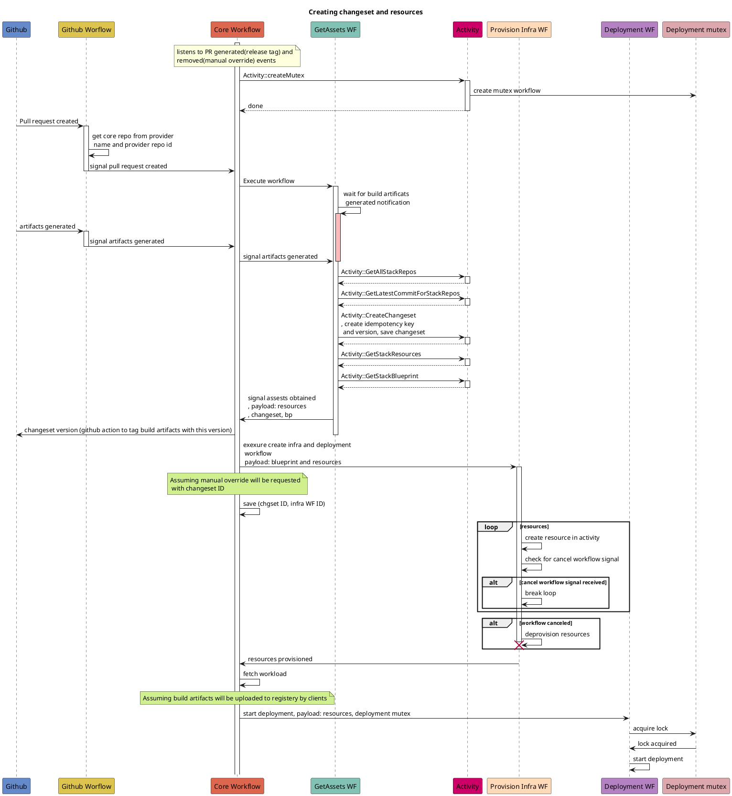

```puml
@startuml
title Creating changeset and resources
participant "Github" as gha #658ACA
participant "Github Worflow" as gw #DCC44E
participant "Core Workflow" as cw #DC674E
participant "GetAssets WF" as awf #82c2b4
participant "Activity" as a #cc0066
participant "Provision Infra WF" as iwf #ffdab9
participant "Deployment WF" as dwf #b482c2
participant "Deployment mutex" as dm #dca8ad

' pull request created
activate cw
note over cw
 listens to PR generated(release tag) and
 removed(manual override) events
 end note
cw->a: Activity::createMutex
activate a
a -> dm: create mutex workflow
return done

gha -> gw: Pull request created
activate gw
gw -> gw: get core repo from provider\n name and provider repo id
gw -> cw: signal pull request created

deactivate gw
deactivate a

cw -> awf: Execute workflow
activate awf
awf -> awf: wait for build artificats\n generated notification
activate awf #FFBBBB


gha -> gw: artifacts generated
activate gw 
gw -> cw: signal artifacts generated
deactivate gw

cw -> awf: signal artifacts generated
deactivate awf

autoactivate on
awf -> a: Activity::GetAllStackRepos
return
awf -> a: Activity::GetLatestCommitForStackRepos
return
awf -> a: Activity::CreateChangeset\n, create idempotency key\n and version, save changeset
return
awf-> a: Activity::GetStackResources
return
awf -> a: Activity::GetStackBlueprint
return
autoactivate off

awf -> cw: signal assests obtained\n, payload: resources\n, changeset, bp 
cw -> gha: changeset version (github action to tag build artifacts with this version)
deactivate awf

cw -> iwf: exexure create infra and deployment\n workflow \n payload: blueprint and resources

note over cw #D0F090
Assuming manual override will be requested
 with changeset ID
end note

activate iwf
cw -> cw: save (chgset ID, infra WF ID)

    loop resources 
    iwf -> iwf: create resource in activity
    iwf -> iwf: check for cancel workflow signal
        alt cancel workflow signal received
            iwf -> iwf: break loop
        end
    end

' pr removed during infra provisioning
    alt workflow canceled
        iwf->iwf: deprovision resources
        destroy iwf
    end

iwf -> cw: resources provisioned
cw-> cw: fetch workload

note over cw  #D0F090
Assuming build artifacts will be uploaded to registery by clients
end note

cw -> dwf: start deployment, payload: resources, deployment mutex
dwf->dm: acquire lock
dm-> dwf: lock acquired
dwf -> dwf: start deployment

@enduml
```
