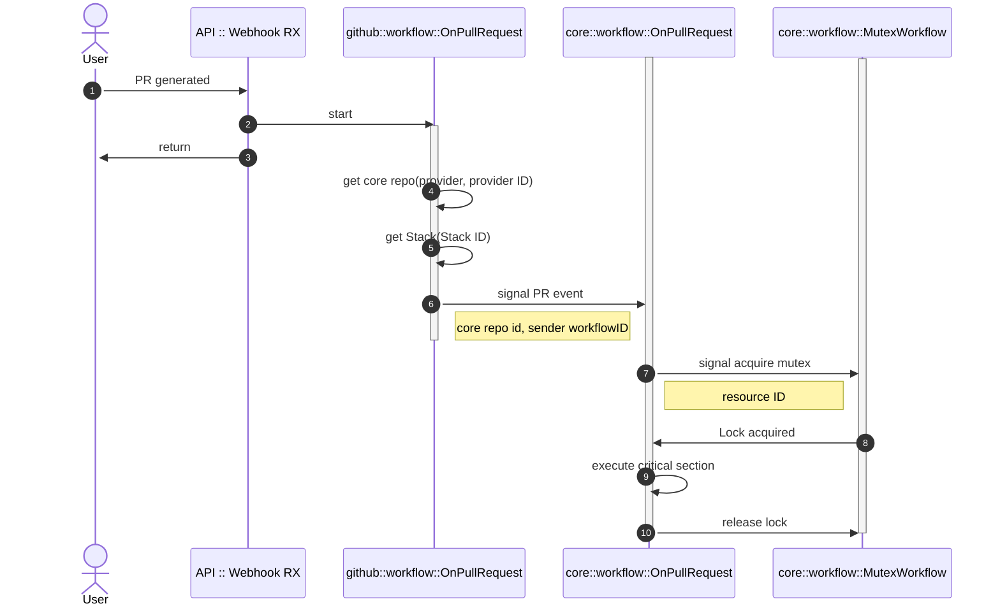

# Core

## Workflows

### Pull Request
.


### Create Stack API
```mermaid
sequenceDiagram
    autonumber
    actor u as user
    participant api as API
    participant cwfpr as core::workflow::OnPullRequest
    participant mwf as core::workflow::MutexWorkflow

  activate u
    u ->>+ api: create Stack
    api ->>+ cwfpr: start
    api ->>- u: return

    cwfpr ->> mwf: start child workflow
    deactivate cwfpr
    <!-- deactivate mwf -->
```
