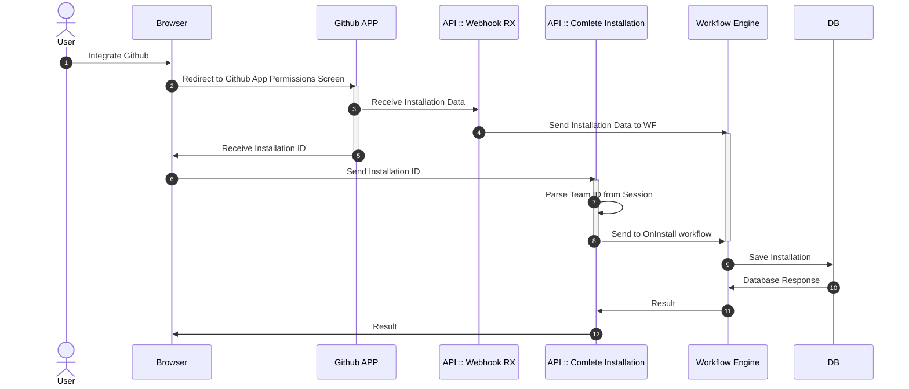

# Github Integration

## Workflows

### Github App Installation

```mermaid
sequenceDiagram
  autonumber
  actor UR as User
  participant UI as Browser
  participant GH as Github APP
  participant WH as API :: Webhook RX
  participant CI as API :: Comlete Installation
  participant WF as Workflow Engine
  participant DB
  UR ->> UI: Integrate Github
  UI ->> GH: Redirect to Github App Permissions Screen
  activate GH
    GH ->> WH: Receive Installation Data
      WH ->> WF: Send Installation Data to WF
      activate WF
    GH ->> UI: Receive Installation ID
  deactivate GH
  UI ->> CI: Send Installation ID
  activate CI
    CI ->> CI: Parse Team ID from Session
    CI ->> WF: Send to OnInstall workflow
    deactivate WF
  deactivate CI
  WF ->> DB: Save Installation
  DB ->> WF: Database Response
  WF ->> CI: Result
  CI ->> UI: Result
```
